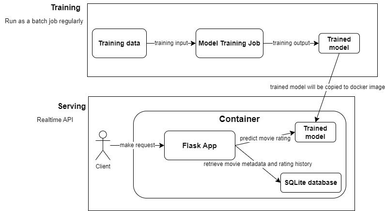

# Movie Recommendation Assignment

---

## Overview
This is a containerized application designed to provide movie recommendations for each user. It consists of two main components: **training** and **serving**.



### Training
We use the Singular Value Decomposition (SVD) algorithm from the `surprise` library to build the model. After training, the model, which predicts movie ratings based on `user_id`, is saved as `model/model.joblib`. The training code is located in `model_training/train_model.py`.

The model's accuracy was evaluated by splitting the data 80:20 and achieving a Root Mean Square Error (RMSE) of 0.87.

For the real-world scenarios, the training should be run regularly with new data to update the information of the rating.

### Serving
The serving component runs a Flask app within a Docker container to handle requests. It uses the trained model to generate recommendations and interacts with a local SQLite database to fetch movie metadata and user rating history.
The requests will be serve via HTTP API.

## Input & Output Examples
the code to generate example can be found in `print_sample_result.py`
- example 1:
   ```
   GET http://localhost:80/recommendations?user_id=18
   ```
   ```json
   {'items': [{'id': 3451}, {'id': 750}]}
   ```

- example 2:
   ```
   GET http://localhost:80/recommendations?user_id=18&returnMetadata=true
   ```
   ```json
   {'items': [{'genres': ['Comedy', 'War'], 'id': 750, 'title': 'Dr. Strangelove or: How I Learned to Stop Worrying and Love the Bomb (1964)'}, {'genres': ['Drama'], 'id': 3451, 'title': "Guess Who's Coming to Dinner (1967)"}]}
   ```

- example 3:
   ```
   GET http://localhost:80/features?user_id=18
   ```
   ```json
   {'features': [{'histories': [1, 2, 6, 16, 32, 34, 36, 47, 50, 70, 104, 110, 111, 145, 163, 165, 180, 208, 223, 231, 235, 260, 288, 293, 296, 318, 329, 337, 344, 356, 364, 367, 370, 374, 377, 380, 431, 435, 442, 457, 466, 480, 500, 502, 508, 527, 541, 555, 586, 588, 589, 590, 593, 595, 608, 628, 648, 653, 673, 745, 778, 780, 784, 849, 858, 904, 908, 913, 919, 923, 924, 1020, 1036, 1059, 1080, 1086, 1089, 1095, 1136, 1148, 1193, 1196, 1198, 1201, 1203, 1206, 1207, 1208, 1209, 1210, 1212, 1213, 1214, 1219, 1221, 1222, 1223, 1227, 1234, 1240, 1245, 1246, 1247, 1252, 1260, 1270, 1275, 1276, 1291, 1356, 1370, 1371, 1374, 1375, 1391, 1466, 1517, 1527, 1544, 1580, 1608, 1617, 1625, 1653, 1676, 1682, 1704, 1721, 1729, 1732, 1784, 1805, 1892, 1917, 1918, 1924, 1954, 1961, 2000, 2001, 2002, 2011, 2012, 2019, 2028, 2058, 2115, 2184, 2194, 2268, 2278, 2291, 2324, 2329, 2409, 2410, 2411, 2412, 2420, 2421, 2422, 2470, 2490, 2542, 2571, 2683, 2692, 2706, 2762, 2918, 2951, 2953, 2959, 2997, 3052, 3081, 3147, 3253, 3257, 3275, 3462, 3578, 3681, 3702, 3751, 3785, 3793, 3896, 3949, 3994, 4007, 4011, 4226, 4239, 4262, 4306, 4327, 4383, 4643, 4728, 4816, 4886, 4896, 4963, 4973, 4993, 4995, 5008, 5120, 5218, 5266, 5349, 5418, 5445, 5459, 5464, 5481, 5574, 5608, 5669, 5679, 5816, 5903, 5944, 5952, 5956, 5989, 5995, 6287, 6300, 6333, 6365, 6373, 6377, 6378, 6440, 6534, 6539, 6548, 6709, 6787, 6807, 6863, 6870, 6874, 6888, 6934, 7018, 7147, 7153, 7254, 7293, 7317, 7318, 7323, 7361, 7373, 7438, 7753, 7843, 8117, 8360, 8361, 8368, 8641, 8644, 8665, 8784, 8798, 8917, 8950, 8957, 8958, 8961, 8984, 26444, 26614, 27689, 27716, 27773, 27831, 27878, 30793, 30812, 31685, 32460, 32587, 33004, 33615, 33794, 34150, 34405, 36519, 36529, 37386, 37729, 37733, 37741, 38038, 38061, 40819, 44022, 44191, 44199, 44555, 44665, 45499, 45517, 45722, 46578, 46965, 47200, 47491, 48394, 48516, 48780, 49651, 50872, 51357, 51540, 51662, 52604, 53125, 53129, 53318, 53464, 53972, 53996, 54272, 54286, 55118, 55247, 55276, 55290, 55765, 56757, 57528, 57640, 57669, 58295, 58299, 58559, 59315, 59615, 59784, 60040, 60074, 60684, 60756, 62434, 63131, 64197, 64614, 64839, 64957, 65596, 66934, 67255, 68073, 68157, 68159, 68319, 68358, 68954, 69122, 69640, 69757, 69951, 70286, 71108, 71156, 71899, 72011, 72378, 72998, 73017, 73268, 73321, 73323, 73499, 74458, 74510, 74789, 74948, 76077, 76175, 76251, 77561, 78469, 78499, 79132, 79293, 79592, 79695, 79702, 80219, 80489, 81788, 83349, 84392, 85354, 85414, 86190, 86332, 86628, 86880, 87232, 88094, 88129, 88140, 89745, 90600, 91485, 91500, 91529, 91542, 91658, 92094, 95441, 96432, 96488, 96610, 96655, 97752, 97938, 98124, 98585, 98809, 99114, 99728, 99813, 102125, 102445, 102903, 103253, 103772, 104241, 104879, 106072, 106487, 106489, 106782, 106839, 107846, 109374, 109487, 110102, 111362, 111759, 112183, 112334, 112421, 112552, 112852, 114060, 114066, 115713, 116797, 116823, 117176, 118900, 119145, 122886, 122892, 122900, 122904, 122918, 122920, 122924, 122926, 128620, 134130, 134853, 135569, 139385, 140289, 141688, 142488, 144210, 145283, 148626, 150548, 155168, 157108, 157110, 158238, 158972, 159093, 160438, 161582, 162350, 162606, 164179, 166015, 166635, 168252, 171023, 176101, 177593, 180095, 180777, 185135]}]}
   ```

## Future Improvements
- **Centralized Model Storage**: Storing the model at a shared location across containers will minimize duplication and streamline updates.
- **Upgraded Database**: Move from SQLite to a more robust database system for enhanced performance and better data sharing capabilities.
- **Configuration File**: Implement a configuration file to define data locations, ports, and other environment-specific settings.
- **Dynamic Model Inputs**: Adapt the model to accept movie ratings in real-time, allowing for more dynamic recommendation adjustments.
- **Batch Predictions**: Calculate predictions in batches to optimize processing speed and efficiency.
---

## Testing
There are 2 types of tests provided:
1) in a **local development environment using Flask's test client** for easy debugging.  (`tests/test_flask_app.py`)
2) against a **Docker container** to ensure production-like conditions. The testing process ensures that all parts of the application perform as expected before deployment. (`tests/test_endpoint.py`)


### Testing with Python Environment


#### Environment Setup
1) make sure you have python 3.11 installed
1) install required python packages
    ```bash
    pip install -r requirements.txt
    ```
#### Running Tests with Flask Test Client
```bash
pytest tests/test_flask_app.py
```

### Testing with Docker Container

#### Starting the Container
```bash
docker build -t myapp .
docker run -d -p 80:80 --name myapp-container myapp
docker logs -f myapp-container
```

#### Running Tests Against the Container
```bash
pytest tests/test_endpoint.py
```

#### Stopping the Container
```bash
docker stop myapp-container
docker rm myapp-container
```

